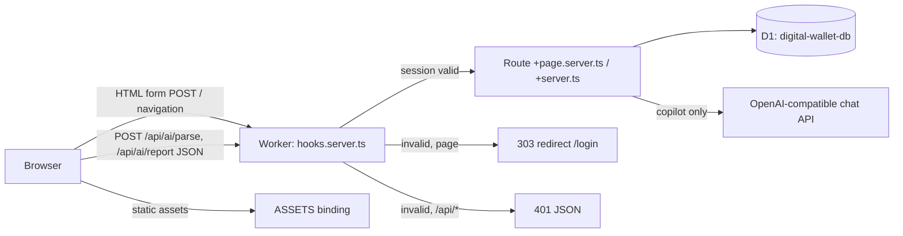

# Architecture

What you'll get from this doc: how a request flows through the app, how the SvelteKit build maps onto Cloudflare Workers, how the code is layered, and which design decisions shaped it (with links to the full specs). For the storage layer in detail see [data-model.md](data-model.md); for running/deploying see [development.md](development.md) and [deployment.md](deployment.md).

## Runtime shape

Everything ships as **one Cloudflare Worker** plus its static-asset bucket, produced by `@sveltejs/adapter-cloudflare`:

- Server code (load functions, form actions, API routes, hooks) compiles to `.svelte-kit/cloudflare/_worker.js` — the Worker entry point (`wrangler.jsonc` → `main`).
- Client chunks, `static/` files (manifest, icons, `sw.js`) are served through the `ASSETS` binding; the adapter's default `serve` fallback sends unmatched requests to the Worker.
- `compatibility_flags: ["nodejs_compat"]` lets server code use `process.env` — secrets/vars from bindings are surfaced there (that is how `src/lib/server/auth.ts` and `ai.ts` read `SESSION_SECRET` / `AI_BASE_URL` / `AI_MODEL` instead of `platform.env`).
- Pages render server-side (SSR); there is no separate API server and no client-side data fetching except the two copilot JSON endpoints.



## Request flow & auth

The single guard is `src/hooks.server.ts`:

1. Read the `dw_session` cookie → `verifySessionToken()` (HMAC-SHA256 over a base64 `{exp, iat}` payload keyed by `SESSION_SECRET`; 7-day expiry). Result lands in `locals.session`.
2. Unauthenticated: `/api/*` gets a JSON 401 (never a redirect); anything except `/login` 303s to `/login`. Authenticated users hitting `/login` bounce to `/`.
3. Each route's `load` also re-checks `locals.session` and redirects (defense in depth).

Login itself (see `docs/specs/2026-09-03-svelte-rewrite-design.md` § Auth Flow for the original design):

- First run: `/login` detects no `master_password_hash` in `app_settings` and shows **setup** mode; submitting sets the password (PBKDF2-SHA256, 100k iterations, stored as `saltHex:hashHex`).
- After that: **login** mode verifies the password. Failed attempts go through the D1-backed rate limiter (`hitRateLimit('login', 15min, 5)` in `src/routes/login/+page.server.ts`) — it survives Worker isolate restarts, unlike an in-memory counter. It deliberately **fails open** if the DB write errors.
- Success issues the cookie via `src/lib/server/session.ts` (`httpOnly`, `sameSite=lax`, `secure` unless dev).
- CSRF: mutations use SvelteKit form actions (built-in origin checks); the two JSON endpoints compare `Origin` to the request origin manually (`src/routes/api/ai/*`).

## Data access

All SQL lives in `src/lib/server/db.ts`; every function takes `D1Database` as its first argument — route files pass `platform!.env.DB`. This keeps the module testable with a fake-Db object (`src/lib/server/db.test.ts`) and keeps D1 out of client code.

Two load-bearing rules:

- **Balances are computed, never stored.** Per-wallet, per-kind, and combined totals all derive from `SUM(CASE type WHEN 'income' THEN amount ELSE -amount END)` over `transactions` (`BALANCE_SQL`, `getKindTotals`). This was the central decision of the digital-wallet transformation — a stored balance column is a sync bug waiting to happen. Source: `docs/specs/2026-09-08-digital-wallet-design.md`.
- **zod validation is server-side, one source of truth.** `src/lib/server/validation.ts` (`TxSchema`, `WalletSchema`, `fieldErrors`) guards every money path; the same schemas run in form actions and API endpoints.

## AI copilot

`src/lib/server/ai.ts` talks to an OpenAI-compatible `/chat/completions` endpoint (default `https://9router.panpan.my.id/v1`, model default `gemini-2.5-flash`, overridable via `AI_BASE_URL` / `AI_MODEL`). `GOOGLE_API_KEY` is the Bearer token name kept for backwards compatibility. Two flows, both POST JSON from `src/routes/copilot/+page.svelte`:

- **Parse** (`POST /api/ai/parse`): free text (≤500 chars) → LLM with the user's wallet list embedded in the system prompt → loose-JSON-tolerant extraction → zod-normalized transactions → client shows checkboxes → confirmed rows bulk-saved through the `?/create-bulk` form action on `/copilot` (re-validated server-side; unknown wallet ids rejected in the endpoint). AI output is *never* trusted to write directly.
- **Report** (`POST /api/ai/report`): current-month summary + category totals + wallet balances serialized to JSON as context → free-form Indonesian answer.

The parse prompt pins category values to the 8 constants in `src/lib/constants.ts` — those two files must stay in sync.

## Frontend layering

- Routes are file-based; each page pairs `+page.server.ts` (load + actions) with `+page.svelte` (Svelte 5 runes, `$props`/`$state`/`$derived`). Mutations never hand-roll `fetch` — form actions + `invalidateAll()` refresh the data.
- Shared components in `src/lib/components/`: `TransactionForm` (create/edit modal, wallet select grouped by kind), `ConfirmModal` (deletes), `Toast`, `Skeleton`, `Navigation` (desktop sidebar + mobile bottom nav), `ThemeToggle`.
- Client state is minimal: toast list in `src/lib/stores.svelte.ts`; modal focus-trap/ESC in `src/lib/modalAccessibility.ts`.
- Formatting/locale helpers centralized in `src/lib/format.ts` (IDR currency, WIB dates). UI strings are Indonesian throughout; identifiers and comments are English.

## Styling & theme

Tailwind CSS v4 via `@tailwindcss/vite` (no config file; `src/app.css` imports `tailwindcss` and defines a class-based `dark` variant). Before first paint, an inline script in `src/app.html` reads `localStorage['ft-theme']` and sets `class="dark|light"` on `<html>`, defaulting to the system preference. `ThemeToggle.svelte` flips the class and persists the choice.

## PWA status: manifest yes, service worker no

The app links `static/manifest.json` (name, colors, standalone display) but **runs without a service worker on purpose**. A cache-first SW cached SSR HTML and `__data.json` responses and never invalidated them — deleted transactions reappeared after navigation (fixed in commit `a501625c`). `static/sw.js` is now a self-cleanup stub: on activate it purges all caches, unregisters itself, and reloads clients; it is no longer registered by app code and is slated for deletion after 2027-01-01. Data lives in D1 and always requires network.

Known cosmetic gap: both `src/app.html` and `manifest.json` reference `/favicon.png`, which does not exist in `static/` (only `icon.svg` does).

## Repository layout

```
├── src/
│   ├── hooks.server.ts        # session guard: cookie → locals.session, 401/redirect rules
│   ├── app.html               # theme init script, manifest link, SvelteKit shell
│   ├── app.css                # Tailwind v4 entry + class-based dark variant
│   ├── app.d.ts               # Platform/Locals types (D1, ASSETS, env var names)
│   ├── lib/
│   │   ├── server/            # db.ts, auth.ts, session.ts, ai.ts, validation.ts (+ *.test.ts)
│   │   ├── components/        # TransactionForm, ConfirmModal, Toast, Skeleton, Navigation, ThemeToggle
│   │   ├── constants.ts       # CATEGORIES (must match ai.ts parse prompt)
│   │   ├── format.ts          # IDR currency + WIB date formatting
│   │   ├── stores.svelte.ts   # toast state (runes)
│   │   └── modalAccessibility.ts
│   └── routes/
│       ├── +page.svelte|.server.ts        # dashboard: totals, balances, recent, quick-add, logout action
│       ├── login/ wallets/ transactions/ analytics/ copilot/ settings/
│       └── api/ai/{parse,report}/+server.ts
├── static/                    # manifest.json, icon.svg, sw.js (cleanup stub only)
├── schema.sql                 # full D1 schema, idempotent (see data-model.md)
├── wrangler.jsonc             # worker name, D1 + ASSETS bindings, nodejs_compat
├── svelte.config.js / vite.config.ts / vitest.config.ts / tsconfig.json
└── docs/ + plan/              # this documentation; plan/ holds approved-but-unmerged work
```

## Decisions not re-documented here

Full rationale lives in the specs — summaries above, details in:

- `docs/specs/2026-09-03-svelte-rewrite-design.md` — framework/hosting/styling/PWA choices of the rewrite.
- `docs/specs/2026-09-08-digital-wallet-design.md` — wallet model, clean-start D1 (no data migration), kind CHECK constraint, seed wallets, rebrand checklist, Workers Builds over manual deploys.

Upcoming changes (transaction `date`, wallet-to-wallet `transfer`, mobile settings) are approved but **not implemented in `main`** — see [index.md](index.md#approved-plans-not-yet-in-main) and the `plan/` documents.
