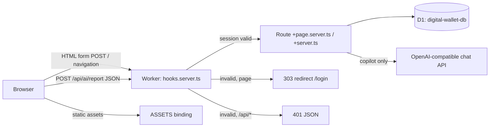

# Architecture

What you'll get from this doc: how a request flows through the app, how the SvelteKit build maps onto Cloudflare Workers, how the code is layered, and which design decisions shaped it (with links to the full specs). For the storage layer in detail see [data-model.md](data-model.md); for running/deploying see [development.md](development.md) and [deployment.md](deployment.md).

## Runtime shape

Everything ships as **one Cloudflare Worker** plus its static-asset bucket, produced by `@sveltejs/adapter-cloudflare`:

- Server code (load functions, form actions, API routes, hooks) compiles to `.svelte-kit/cloudflare/_worker.js` — the Worker entry point (`wrangler.jsonc` → `main`).
- Client chunks, `static/` files (manifest, icons, `sw.js`) are served through the `ASSETS` binding; the adapter's default `serve` fallback sends unmatched requests to the Worker.
- `compatibility_flags: ["nodejs_compat"]` lets server code use `process.env` — secrets/vars from bindings are surfaced there (that is how `src/lib/server/auth.ts` and `ai.ts` read `SESSION_SECRET` / `AI_BASE_URL` / `AI_MODEL`; `src/routes/api/ai/report/+server.ts` reads `GOOGLE_API_KEY` from `platform.env` instead).
- Pages render server-side (SSR); there is no separate API server and no client-side data fetching except the one copilot JSON endpoint (`/api/ai/report`).



## Request flow & auth

The single guard is `src/hooks.server.ts`:

1. Read the `dw_session` cookie → `verifySessionToken()` (HMAC-SHA256 over a base64 `{exp, iat}` payload keyed by `SESSION_SECRET`; 7-day expiry). Result lands in `locals.session`.
2. Unauthenticated: `/api/*` gets a JSON 401 (never a redirect); anything except `/login` 303s to `/login`. Authenticated users hitting `/login` bounce to `/`.
3. Each route's `load` also re-checks `locals.session` and redirects (defense in depth).

Login itself (see `docs/specs/2026-09-03-svelte-rewrite-design.md` § Auth Flow for the original design):

- First run: `/login` detects no `master_password_hash` in `app_settings` and shows **setup** mode; submitting sets the password (PBKDF2-SHA256, 100k iterations, stored as `saltHex:hashHex`).
- After that: **login** mode verifies the password. Failed attempts go through the D1-backed rate limiter (`hitRateLimit('login', 15min, 5)` in `src/routes/login/+page.server.ts`) — it survives Worker isolate restarts, unlike an in-memory counter. It deliberately **fails open** if the DB write errors.
- Success issues the cookie via `src/lib/server/session.ts` (`httpOnly`, `sameSite=lax`, `secure` unless dev).
- CSRF: mutations use SvelteKit form actions (built-in origin checks); the copilot JSON endpoint compares `Origin` to the request origin manually (`src/routes/api/ai/report/+server.ts`).

## Data access

All SQL lives in `src/lib/server/db.ts`; every function takes `D1Database` as its first argument — route files pass `platform!.env.DB`. This keeps the module testable with a fake-Db object (`src/lib/server/db.test.ts`) and keeps D1 out of client code.

Two load-bearing rules:

- **Balances are computed, never stored.** Per-wallet, per-kind, and combined totals all derive from a `SUM(CASE …)` over `transactions` that signs income/expense and, for `transfer`, keys off which wallet the row touches (`BALANCE_CASE`/`BALANCE_SQL`, `getKindTotals`). This was the central decision of the digital-wallet transformation — a stored balance column is a sync bug waiting to happen. Source: `docs/specs/2026-09-08-digital-wallet-design.md`.
- **zod validation is server-side, one source of truth.** `src/lib/server/validation.ts` (`TxSchema`, `WalletSchema`, `DebtSchema`, `DebtPaymentSchema`, `fieldErrors`) guards every money path; the same schemas run in form actions and API endpoints.

## AI copilot

`/copilot` is an Indonesian chatbox: free-form questions answered from a per-request JSON snapshot of the user's finances (wallet balances, this/last-month summaries, category totals, 6-month trend, open debts, 10 recent transactions) built by `src/routes/api/ai/report/+server.ts` and sent to `chatAnswer()` in `src/lib/server/ai.ts`. The call goes to an OpenAI-compatible `/chat/completions` endpoint; the AI is strictly read-only (server-side chat history is not stored — the client replays the last ≤8 turns). The earlier free-text **parse** flow (`/api/ai/parse`, preview → confirm → bulk save) was removed with the chatbox rework.

Provider config resolves in precedence order (shared by the report endpoint, `resolveProviderConfig` in `src/lib/server/aiProviders.ts`):

1. per-request body override (`providerId`/`model`, model honored only if it is one of that provider's models),
2. a user-stored provider in `app_settings` (`ai_providers` JSON array + `ai_active_provider`), managed via CRUD form actions on `/settings`; keys are stored plaintext (single-user tradeoff) and stripped by `toSummary()` before anything ships to the client,
3. env fallback `GOOGLE_API_KEY` / `AI_BASE_URL` (default `https://9router.panpan.my.id/v1`) / `AI_MODEL` (default `gemini-2.5-flash`).

With neither a stored provider nor `GOOGLE_API_KEY`, `/api/ai/report` returns 503 ("Fitur AI belum dikonfigurasi") and the copilot degrades gracefully.

The 8 fixed transaction categories in `src/lib/constants.ts` drive the form/category filter; there is no AI parse prompt to keep them in sync with anymore.

## Frontend layering

- Routes are file-based; each page pairs `+page.server.ts` (load + actions) with `+page.svelte` (Svelte 5 runes, `$props`/`$state`/`$derived`). Mutations never hand-roll `fetch` — form actions + `invalidateAll()` refresh the data.
- Shared components in `src/lib/components/`: `TransactionForm` (create/edit modal), `ConfirmModal` (deletes), `ModalShell` (accessible dialogs with `center` modal and `sheet` bottom drawer variants, reduced-motion aware), `Toast`, `Skeleton`, `Navigation` (desktop sidebar + 5-slot mobile bottom navigation with "Lainnya" sheet menu), `ThemeToggle`, `WalletSelect` (grouped by kind).
- Charts: rendered via LayerChart (`layerchart/svg` — `BarChart`, `PieChart`) on `/` (6-month monthly trend) and `/analytics` (category distribution and monthly trends). Themed via unlayered `.lc-root-container` CSS variable overrides in `src/app.css` without importing external library CSS.
- Client state is minimal: toast list in `src/lib/stores.svelte.ts`; modal focus-trap/ESC in `src/lib/modalAccessibility.ts`.
- Formatting/locale helpers centralized in `src/lib/format.ts` (IDR currency, WIB dates). UI strings are Indonesian throughout; identifiers and comments are English.

## Styling & theme

Tailwind CSS v4 via `@tailwindcss/vite` (no config file; `src/app.css` imports `tailwindcss` and defines a class-based `dark` variant). Before first paint, an inline script in `src/app.html` reads `localStorage['ft-theme']` and sets `class="dark|light"` on `<html>`, defaulting to the system preference. `ThemeToggle.svelte` flips the class and persists the choice. Safe-area inset bottom padding (`pb-[env(safe-area-inset-bottom)]`) ensures mobile bars stay above system navigation indicators.

## PWA status: manifest yes, service worker no

The app links `static/manifest.json` (name, colors, standalone display) but **runs without a service worker on purpose**. A cache-first SW cached SSR HTML and `__data.json` responses and never invalidated them — deleted transactions reappeared after navigation (fixed in commit `a501625c`). `static/sw.js` is now a self-cleanup stub: on activate it purges all caches, unregisters itself, and reloads clients; it is no longer registered by app code and is slated for deletion after 2027-01-01. Data lives in D1 and always requires network.

App icon is `static/icon.svg` only.

## Repository layout

```
├── src/
│   ├── hooks.server.ts        # session guard: cookie → locals.session, 401/redirect rules
│   ├── app.html               # theme init script, manifest link, SvelteKit shell
│   ├── app.css                # Tailwind v4 entry + class-based dark variant
│   ├── app.d.ts               # Platform/Locals types (D1, ASSETS, env var names)
│   ├── lib/
│   │   ├── server/            # db.ts, auth.ts, session.ts, ai.ts, aiProviders.ts, validation.ts (+ *.test.ts)
│   │   ├── components/        # TransactionForm, ConfirmModal, Toast, Skeleton, Navigation, ThemeToggle, WalletSelect, ModalShell
│   │   ├── constants.ts       # CATEGORIES, AMOUNT_PRESETS
│   │   ├── format.ts          # IDR currency + WIB date formatting
│   │   ├── stores.svelte.ts   # toast state (runes)
│   │   └── modalAccessibility.ts
│   └── routes/
│       ├── +page.svelte|.server.ts        # dashboard: totals, balances, 6-month trend, recent, quick-add, logout action
│       ├── login/ wallets/ transactions/ hutang/ analytics/ copilot/ settings/
│       └── api/ai/report/+server.ts       # copilot chatbox JSON endpoint
│       └── api/backup/export/+server.ts   # JSON backup + CSV transaction downloads
├── static/                    # manifest.json, icon.svg, sw.js (cleanup stub only)
├── schema.sql                 # full D1 schema, idempotent (see data-model.md)
├── migrations/                # one-off structural migrations (NNN-*.sql), applied manually
├── wrangler.jsonc             # worker name, D1 + ASSETS bindings, nodejs_compat
├── svelte.config.js / vite.config.ts / vitest.config.ts / tsconfig.json
└── docs/ + plan/              # this documentation; plan/ holds approved-but-unmerged work
```

## Decisions not re-documented here

Full rationale lives in the specs — summaries above, details in:

- `docs/specs/2026-09-03-svelte-rewrite-design.md` — framework/hosting/styling/PWA choices of the rewrite.
- `docs/specs/2026-09-08-digital-wallet-design.md` — wallet model, clean-start D1 (no data migration), kind CHECK constraint, seed wallets, rebrand checklist, Workers Builds over manual deploys.

Visual layer (merged `ui-redesign` and `ui-visual-overhaul`): design tokens and component utilities live in `src/app.css`:
- Surfaces & depth: `.card` (solid fills only; light mode border + subtle shadow, dark mode hairline ring `dark:ring-1 dark:ring-white/5` — no gradients).
- Buttons: `.btn`, `.btn-primary`, `.btn-outline`, `.btn-danger`, `.btn-ghost`.
- Form inputs: `.input`, `.label`, `.chip`.
- Layout & headers: `.page-header`, `.page-title`, `.page-subtitle`, `.section-header`, `.section-title`.
- Lists: `.list`, `.list-row` (grouped surface with dividers and 150ms interactive feedback).
- Icons & media: `.tile` (fixed 8x8 box geometry for icon backgrounds).
- Navigation: 5-slot mobile bottom bar with "Lainnya" bottom sheet drawer (`ModalShell variant="sheet"`) and safe-area inset padding `pb-[env(safe-area-inset-bottom)]`.
- Brand & typography: single orange-600 brand accent, semantic palette (emerald income, red expense, sky digital kind, amber cash kind, neutral slate transfers), Plus Jakarta Sans font, `tabular-nums` on monetary figures, and global `prefers-reduced-motion` collapse.
