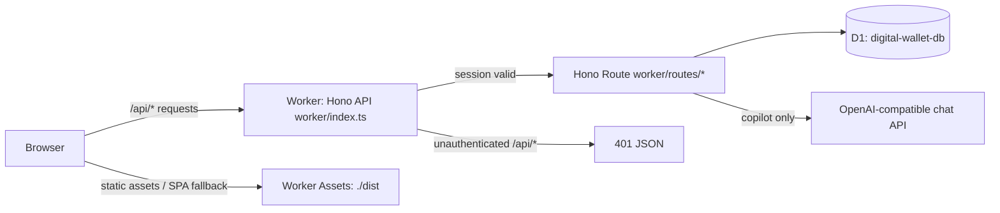

# Architecture

What you'll get from this doc: how a request flows through the app, how the Vite+React build maps onto Cloudflare Workers, how the code is layered, and which design decisions shaped it (with links to the full specs). For the storage layer in detail see [data-model.md](data-model.md); for running/deploying see [development.md](development.md) and [deployment.md](deployment.md).

## Runtime shape

Everything ships as **one Cloudflare Worker** with static asset serving:

- Backend code is a [Hono](https://hono.dev/) app in `worker/index.ts` — the Worker entry point (`wrangler.jsonc` → `main: worker/index.ts`).
- Frontend is a Vite + React 19 Single Page Application in `web/`, built to `dist/`.
- Wrangler static assets configuration (`assets: { directory: "./dist", not_found_handling: "single-page-application" }`) serves the client chunks, icons, and SPA fallback.
- `compatibility_flags: ["nodejs_compat"]` lets worker code use Node compatibility where needed.
- Hono handles all `/api/*` requests with session cookie middleware; static assets and SPA routes are handled directly by Cloudflare Worker Assets.

## Request flow & auth

The auth guard runs in Hono middleware in `worker/index.ts` and `worker/auth.ts`:

1. Read the `dw_session` cookie → `verifySessionToken()` (HMAC-SHA256 over a base64 `{exp, iat}` payload keyed by `SESSION_SECRET`; 7-day expiry).
2. Unauthenticated: `/api/*` gets a JSON 401 (never a redirect). Public routes (`/api/auth/status`, `/api/auth/login`, `/api/auth/setup`) bypass authentication.
3. Client-side: `web/src/api/client.ts` catches 401 responses and automatically redirects the SPA to `/login`.

Login flow:

- First run: `/api/auth/status` indicates `setupRequired: true` when no `master_password_hash` exists in `app_settings`. `/login` renders **setup** mode; submitting sets the master password (PBKDF2-SHA256, 100k iterations, stored as `saltHex:hashHex`).
- After setup: **login** mode verifies the password against the stored hash. Failed attempts go through the D1-backed rate limiter (`hitRateLimit('login', 15min, 5)`) — surviving Worker isolate restarts. It deliberately **fails open** if the DB write errors.
- Success issues the cookie via `worker/session.ts` (`httpOnly`, `sameSite=lax`, `secure` unless dev).

## Data access

All SQL lives in `worker/db.ts`; every function takes `D1Database` as its first argument. This keeps the module testable with a fake-Db object (`worker/db.test.ts`) and keeps D1 out of client code.

Two load-bearing rules:

- **Balances are computed, never stored.** Per-wallet, per-kind, and combined totals all derive from a `SUM(CASE …)` over `transactions` that signs income/expense and, for `transfer`, keys off which wallet the row touches (`BALANCE_CASE`/`BALANCE_SQL`, `getKindTotals`). A stored balance column is a sync bug waiting to happen.
- **zod validation is server-side, one source of truth.** `shared/validation.ts` (`TxSchema`, `WalletSchema`, `DebtSchema`, `DebtPaymentSchema`, `fieldErrors`) guards every money path; the same schemas validate API requests and forms.

## AI copilot

`/copilot` is an Indonesian chatbox: free-form questions answered from a per-request JSON snapshot of the user's finances (wallet balances, this/last-month summaries, category totals, 6-month trend, open debts, 10 recent transactions) built by `worker/routes/ai.ts` and sent to `chatAnswer()` in `worker/ai.ts`. The call goes to an OpenAI-compatible `/chat/completions` endpoint; the AI is strictly read-only (server-side chat history is not stored — the client replays the last ≤8 turns).

Provider config resolves in precedence order (`worker/aiProviders.ts`):

1. per-request body override (`providerId`/`model`, model honored only if it is one of that provider's models),
2. a user-stored provider in `app_settings` (`ai_providers` JSON array + `ai_active_provider`), managed via CRUD on `/settings`; keys are stored plaintext (single-user tradeoff) and stripped by `toSummary()` before anything ships to the client,
3. env fallback `GOOGLE_API_KEY` / `AI_BASE_URL` (default `https://9router.panpan.my.id/v1`) / `AI_MODEL` (default `gemini-2.5-flash`).

With neither a stored provider nor `GOOGLE_API_KEY`, `/api/ai/report` returns 503 ("Fitur AI belum dikonfigurasi") and the copilot degrades gracefully.

## Frontend layering

- Pure React SPA in `web/src/` powered by Vite, React Router 7, and TanStack Query 5.
- Shared components in `web/src/components/`: `TransactionForm` (create/edit modal), `ConfirmModal` (deletes), `ModalShell` (accessible dialogs with `center` modal and `sheet` bottom drawer variants), `Toast`, `Skeleton`, `Navigation` (desktop sidebar + 5-slot mobile floating pill with "Lainnya" sheet menu), `ThemeToggle`, `WalletSelect` (grouped by kind).
- Charts: rendered via Recharts (`web/src/components/charts/`) on `/analytics` (category distribution, comparison bars, wallet spend breakdown, and 6-month monthly trend). Themed via unlayered `.chart-root` CSS variable overrides in `web/src/index.css` mapped to Catppuccin palette tokens.
- Styling: Tailwind CSS 4 (`@tailwindcss/vite`), Catppuccin Latte (light) & Mocha (dark). Fixed Mocha surfaces for dark summary cards and mobile bottom nav.
- Formatting/locale helpers centralized in `shared/format.ts` (IDR currency, WIB dates). UI strings are Indonesian throughout; identifiers and comments are English.
