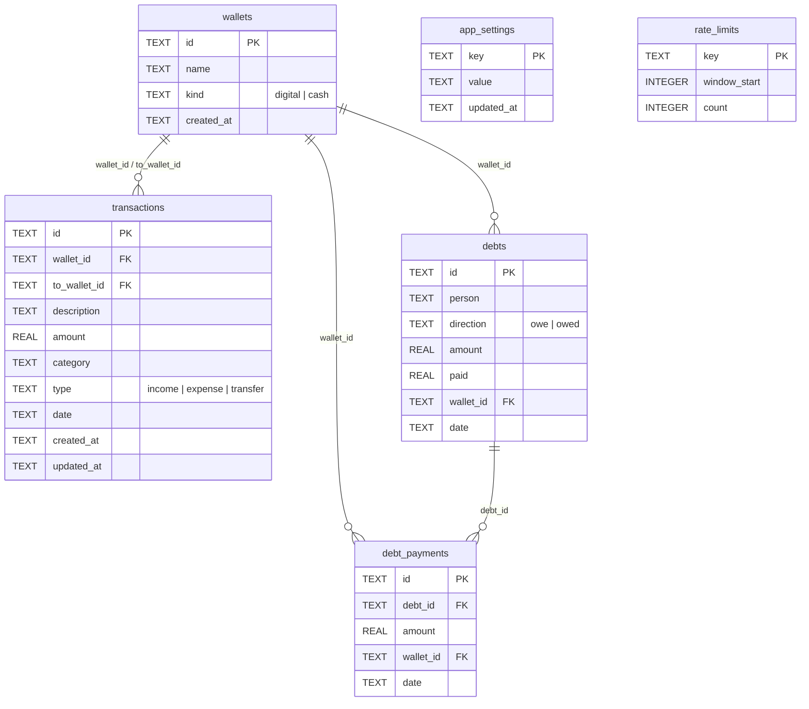

# Data Model

What you'll get from this doc: every table in [`schema.sql`](../schema.sql) with columns, types, defaults and constraints; which code reads/writes each; the applied `migrations/` history; and the query-level gotchas (`date` vs `created_at`, computed balances) you need before touching any SQL. Request flow around the data lives in [architecture.md](architecture.md).

All data lives in one Cloudflare D1 database, `digital-wallet-db` (binding `DB`, id `a6c5170a-84d4-4077-9670-5dadeac0eba5` — `wrangler.jsonc`). `schema.sql` is idempotent (`CREATE ... IF NOT EXISTS`, `INSERT OR IGNORE`): re-applying it is safe and is how schema changes ship (see [deployment.md](deployment.md)).

## ER overview

Six tables: four domain (`wallets`, `transactions`, `debts`, `debt_payments`), two infrastructure (`app_settings`, `rate_limits`).

## `wallets` (schema.sql:4-9)

Named money containers; two seeded rows exist from day one.

| Column | Type | Constraints / default | Notes |
|---|---|---|---|
| `id` | TEXT | PK, default `lower(hex(randomblob(16)))` | App inserts use `crypto.randomUUID()` dashes-stripped instead (`db.ts:97`) |
| `name` | TEXT | NOT NULL | ≤50 chars enforced in app (`validation.ts` `WalletSchema`), not in DB |
| `kind` | TEXT | NOT NULL, CHECK `IN ('digital','cash')` | Drives dashboard subtotals; DB CHECK is the source of truth |
| `created_at` | TEXT | default `datetime('now')` | UTC `YYYY-MM-DD HH:MM:SS` |

Seed rows (schema.sql:67-70): `seed-cash` / "Tunai" (cash), `seed-digital` / "Dompet Digital" (digital). Fixed ids + `INSERT OR IGNORE` make re-application idempotent.

Writes: `createWallet` / `updateWallet` / `deleteWallet` (`db.ts:92-143`). **Names are unique at app level**: `walletNameExists` compares case-insensitively after trimming (own row excluded on rename) and both create and update return `'duplicate'`, surfaced as a form error (`wallets/+page.server.ts`). **Deletes are guarded at app level**: `deleteWallet` counts transactions referencing the wallet as source *or* `to_wallet_id` and refuses with `'has-transactions'`. `adjustWalletBalance` (`db.ts:172-190`) implements "Atur Saldo" without storing a balance: it posts one adjustment transaction (income/expense, description "Penyesuaian saldo") for the diff.

## `transactions` (schema.sql:11-22)

One row per income, expense, or wallet-to-wallet transfer, always attached to one wallet.

| Column | Type | Constraints / default | Notes |
|---|---|---|---|
| `id` | TEXT | PK, randomblob default | App-generated UUID hex (`db.ts:272`) |
| `wallet_id` | TEXT | NOT NULL, REFERENCES `wallets(id)` | Source wallet. Required by `TxSchema` (`walletId`, "Pilih dompet dulu") |
| `to_wallet_id` | TEXT | nullable, REFERENCES `wallets(id)` | Destination, set only for `transfer`; `TxSchema` rejects transfer with missing/identical destination ("Pilih dompet tujuan yang berbeda") |
| `description` | TEXT | NOT NULL | Non-empty after trim (`validation.ts`) |
| `amount` | REAL | NOT NULL | IDR. Positive integer enforced in app (`zod .int().positive().max(999_999_999)`); sign is implied by `type`, never by `amount` |
| `category` | TEXT | default `'Lainnya'` | Free text in DB; app offers the 8 fixed values of `src/lib/constants.ts` (Makanan, Transportasi, Tagihan, Hiburan, Belanja, Kesehatan, Pendidikan, Lainnya) |
| `type` | TEXT | default `'expense'`, CHECK `IN ('income','expense','transfer')` | `transfer` rows are **excluded** from income/expense aggregates (`type != 'transfer'`) and signed per side in balance queries |
| `date` | TEXT | NOT NULL, default `date('now')` | `YYYY-MM-DD`, the calendar day all month filters use. Empty form input defaults to today in **WIB** (`todayISO()`, `format.ts`); format checked by regex in `TxSchema` |
| `created_at` | TEXT | default `datetime('now')` | See format gotcha below |
| `updated_at` | TEXT | default `datetime('now')` | Refreshed by `updateTransaction` (`db.ts:345-346`) |

Indexes (schema.sql:24-28): `created_at DESC`, `date DESC`, `category`, `type`, `wallet_id`.

Reads/writes all in `db.ts`: `listTransactions` (newest-first by `date, created_at`, joins source + destination wallet names, filters `month` (on `date`) + `walletId` + `search` (description LIKE) + `category`, `limit`/`offset`; the `/transactions` page uses limit 50 — `transactions/+page.server.ts:25`), `getTransaction`, `createTransaction`, `createTransactions` (batch insert), `updateTransaction`, `deleteTransaction`, `deleteTransactions` (bulk delete, returns count — `?/bulkDelete` actions).

Debt payments also write `transactions` rows: recording a payment (or creating a debt with "reduce balance") atomically inserts a matching expense/income transaction (`category 'Lainnya'`, descriptions like "Bayar utang ke …") alongside the `debt_payments` row — see `debts` below.

### `created_at` format gotcha

Rows get **two different textual formats** depending on who wrote them:

- app inserts/updates → JS ISO: `2026-09-08T03:15:00.000Z` (`db.ts:273`)
- DB default (manual inserts) → SQLite: `2026-09-08 03:15:00`

Both start with `YYYY-MM-DD`, and since the migration added the dedicated `date` column, all month/trend queries filter on `date` (`date LIKE 'YYYY-MM%'` in `getMonthlySummary`/`getCategoryTotals`/`listTransactions`, `substr(date, 1, 7)` in `getMonthlyTotals`) instead of parsing `created_at`. Migration `migrations/001-tx-date-transfer.sql` backfilled `date` from `substr(created_at, 1, 10)`. `created_at` remains ordering tiebreaker only.

Timestamps are UTC everywhere; display converts to Asia/Jakarta (`format.ts`).

## `debts` and `debt_payments` (schema.sql:31-53)

Two-way debt tracking (`/hutang`), independent of the income/expense aggregates: a debt row never touches `wallets` balances by itself — only its **payments** do, by writing a matching `transactions` row.

| Column (`debts`) | Type | Constraints / default | Notes |
|---|---|---|---|
| `id` | TEXT | PK, randomblob default | App-generated UUID hex |
| `person` | TEXT | NOT NULL | Counterparty name, ≤60 chars in app (`DebtSchema`) |
| `direction` | TEXT | NOT NULL, CHECK `IN ('owe','owed')` | `owe` = Hutang Saya (you borrowed), `owed` = Piutang Saya (you lent) |
| `amount` | REAL | NOT NULL, CHECK `> 0` | Original principal |
| `paid` | REAL | NOT NULL DEFAULT 0, CHECK `>= 0` | Invariant: equals `SUM(debt_payments.amount)` — maintained by atomic `db.batch` updates in `addDebtPayment`; DB does not enforce it |
| `wallet_id` | TEXT | nullable, REFERENCES `wallets(id)` | Settlement wallet; required in app only when "reduce balance" is ticked |
| `date` | TEXT | NOT NULL, default `date('now')` | Record date, same `YYYY-MM-DD` rules as transactions |

| Column (`debt_payments`) | Type | Constraints / default | Notes |
|---|---|---|---|
| `id` | TEXT | PK, randomblob default | |
| `debt_id` | TEXT | NOT NULL, REFERENCES `debts(id)` ON DELETE CASCADE | |
| `amount` | REAL | NOT NULL, CHECK `> 0` | Overpay (amount > remaining) rejected in app (`addDebtPayment` returns `'overpay'`) |
| `wallet_id` | TEXT | NOT NULL, REFERENCES `wallets(id)` | Payment always moves a wallet balance (via its paired transaction) |
| `date` | TEXT | NOT NULL, default `date('now')` | |

Indexes (schema.sql:52-53): `debt_payments(debt_id)`, `debts(direction)`.

> Deleting a debt removes its `debt_payments` rows (explicit batch delete, not reliant on `ON DELETE CASCADE`) but leaves the paired `transactions` rows in place: the money already moved, only the debt record disappears.

Code: `db.ts:526-719` — `listDebts` / `listOpenDebts` (`amount > paid`, feeds the dashboard summary and the AI context) / `getDebt` / `createDebt` (optional `reduceBalance` mode creates the debt fully paid in one batch: debt + payment row + transaction) / `addDebtPayment` (batch: payment row + transaction + `paid` increment) / `deleteDebt` (atomic batch: child `debt_payments` then `debts`) / `deleteDebts` (same, bulk; returns `{ deleted }`) / `getDebtDirectionTotals`. UI copy: "Hutang Saya" / "Piutang Saya".

## `app_settings` (schema.sql:55-59)

Key/value store (`key` PK, `value` NOT NULL, `updated_at`). Read/write via `getSetting` / `setSetting` (upsert, `db.ts:474-493`). Known keys:

| Key | Written by | Purpose |
|---|---|---|
| `master_password_hash` | login setup action, settings change-password | PBKDF2 hash `saltHex:hashHex` (16-byte salt, SHA-256, 100k iterations, `auth.ts:37-56`). Its presence/absence switches `/login` between setup and login mode |
| `ai_providers` | settings AI save/delete actions | JSON array of user-configured AI providers `{ id, name, baseUrl, apiKey, model, models[] }`. Read by `aiProviders.ts` (defensive parse → `[]` on corrupt data). API keys are stored plaintext — accepted tradeoff for a single-user app behind a master password, and never sent to the client |
| `ai_active_provider` | settings AI set-active action | Id of the active AI provider (`''` = none → env fallback `GOOGLE_API_KEY`/`AI_BASE_URL`/`AI_MODEL`) |

## `rate_limits` (schema.sql:61-65)

Sliding-window counter backing login throttling: `key` PK, `window_start` (epoch ms), `count`. `hitRateLimit(db, key, windowMs, max)` (`db.ts:500-524`) upserts with one atomic statement and returns whether the request fits the window. Only key in use: `login` (5 attempts / 15 minutes, `login/+page.server.ts:37`). Note it fails **open** on DB errors. Old rows are never pruned; at ≤5 tries per window this is negligible (a cleanup path only matters if new keys get added — `ponytail`-style trade-off, acceptable at this scale).

## Computed balances (no stored balance anywhere)

Every balance in the app derives from transactions — single source of truth:

| Query | Where | Definition |
|---|---|---|
| Per wallet | `BALANCE_CASE`/`BALANCE_SQL`, `db.ts:147-158` | Income `+`, expense `−`; a `transfer` row is `−` for its `wallet_id` side and `+` for its `to_wallet_id` side; `LEFT JOIN` on both sides so empty wallets show 0 |
| Per kind subtotal + grand total | `getKindTotals`, `db.ts:193-209` | Same CASE `GROUP BY wallets.kind`; total = digital + cash |
| Monthly income/expense/net | `getMonthlySummary`, `db.ts:374-392` | `SUM(amount)` `GROUP BY type` for `date LIKE 'YYYY-MM%'`, transfers excluded |
| Category totals for a month | `getCategoryTotals`, `db.ts:395-411` | `GROUP BY category, type ORDER BY total DESC`, transfers excluded |
| 6-month trend | `getMonthlyTotals`, `db.ts:418-452` | Last N months by `date`, zero-filled, oldest first |

Dashboard, wallets page, and the AI chat context all reuse these — there is no second implementation to drift. Debt *remaining* is likewise computed (`amount − paid`, in `DEBT_SELECT`), never stored.

## Migration history (`migrations/`)

Structural changes ship as numbered scripts in `migrations/`, applied manually (local **and** remote) before the code that expects the new shape — see [deployment.md](deployment.md). `schema.sql` always describes the final shape for fresh databases.

- `001-tx-date-transfer.sql` — rebuilds `transactions` to add `date`, `to_wallet_id`, and the `transfer` CHECK value; backfills `date` from `substr(created_at, 1, 10)`; preserves rows.
- `002-debts.sql` — creates `debts` + `debt_payments` and their indexes (additive only).
