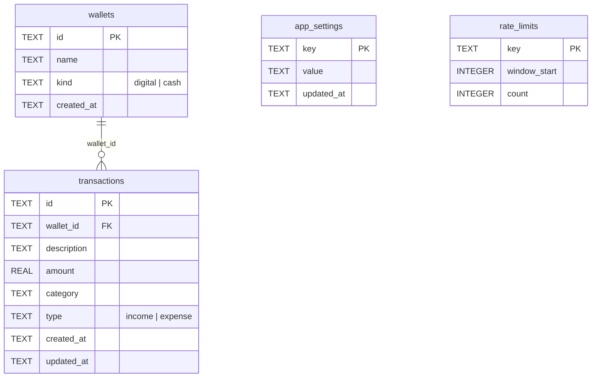

# Data Model

What you'll get from this doc: every table in [`schema.sql`](../schema.sql) with columns, types, defaults and constraints; which code reads/writes each; and the query-level gotchas (mixed `created_at` formats, computed balances) you need before touching any SQL. Request flow around the data lives in [architecture.md](architecture.md).

All data lives in one Cloudflare D1 database, `digital-wallet-db` (binding `DB`, id `a6c5170a-84d4-4077-9670-5dadeac0eba5` — `wrangler.jsonc`). `schema.sql` is idempotent (`CREATE ... IF NOT EXISTS`, `INSERT OR IGNORE`): re-applying it is safe and is how schema changes ship (see [deployment.md](deployment.md)).

## ER overview

Four tables: two domain (`wallets`, `transactions`), two infrastructure (`app_settings`, `rate_limits`).

## `wallets` (schema.sql:4-9)

Named money containers; two seeded rows exist from day one.

| Column | Type | Constraints / default | Notes |
|---|---|---|---|
| `id` | TEXT | PK, default `lower(hex(randomblob(16)))` | App inserts use `crypto.randomUUID()` dashes-stripped instead (`db.ts:70`) |
| `name` | TEXT | NOT NULL | ≤50 chars enforced in app (`validation.ts` `WalletSchema`), not in DB |
| `kind` | TEXT | NOT NULL, CHECK `IN ('digital','cash')` | Drives dashboard subtotals; DB CHECK is the source of truth |
| `created_at` | TEXT | default `datetime('now')` | UTC `YYYY-MM-DD HH:MM:SS` |

Seed rows (schema.sql:40-42): `seed-cash` / "Tunai" (cash), `seed-digital` / "Dompet Digital" (digital). Fixed ids + `INSERT OR IGNORE` make re-application idempotent.

Writes: `createWallet` / `updateWallet` / `deleteWallet` (`db.ts:66-112`). **Deletes are guarded at app level**: `deleteWallet` counts referencing transactions first and refuses with `'has-transactions'` (`db.ts:101-112`, surfaced in `src/routes/wallets/+page.server.ts`).

## `transactions` (schema.sql:11-20)

One row per income or expense entry, always attached to one wallet.

| Column | Type | Constraints / default | Notes |
|---|---|---|---|
| `id` | TEXT | PK, randomblob default | App-generated UUID hex (`db.ts:192`) |
| `wallet_id` | TEXT | NOT NULL, REFERENCES `wallets(id)` | Required by `TxSchema` (`walletId`, "Pilih dompet dulu"); AI parse results are rejected server-side if the wallet id isn't real (`api/ai/parse/+server.ts:30-33`) |
| `description` | TEXT | NOT NULL | Non-empty after trim (`validation.ts`) |
| `amount` | REAL | NOT NULL | IDR. Positive integer enforced in app (`zod .int().positive().max(999_999_999)`); sign is implied by `type`, never by `amount` |
| `category` | TEXT | default `'Lainnya'` | Free text in DB; app offers the 8 fixed values of `src/lib/constants.ts` (Makanan, Transportasi, Tagihan, Hiburan, Belanja, Kesehatan, Pendidikan, Lainnya) — same list the AI prompt uses |
| `type` | TEXT | default `'expense'`, CHECK `IN ('income','expense')` | A planned `transfer` type does **not** exist in `main` yet (see `plan/ux-data-model.md`) |
| `created_at` | TEXT | default `datetime('now')` | See format gotcha below |
| `updated_at` | TEXT | default `datetime('now')` | Refreshed by `updateTransaction` (`db.ts:253-254`) |

Indexes (schema.sql:22-25): `created_at DESC`, `category`, `type`, `wallet_id`.

Reads/writes all in `db.ts`: `listTransactions` (newest-first, join with wallet name/kind, filters `month` + `walletId`, default limit 100; the `/transactions` page uses 50 — `transactions/+page.server.ts:22`), `getTransaction`, `createTransaction`, `createTransactions` (batch insert used by copilot bulk-save), `updateTransaction`, `deleteTransaction`.

### `created_at` format gotcha

Rows get **two different textual formats** depending on who wrote them:

- app inserts → JS ISO: `2026-09-08T03:15:00.000Z` (`db.ts:193`)
- DB default (manual inserts) → SQLite: `2026-09-08 03:15:00`

Both start with `YYYY-MM-DD`, which is what the queries exploit: month filters use `created_at LIKE 'YYYY-MM%'` (`getMonthlySummary`, `getCategoryTotals`, `listTransactions`) and the 6-month trend uses `substr(created_at, 1, 7)` (`getMonthlyTotals`, `db.ts:324`). String ordering happens to match time ordering for both formats. **Any new date query must keep working with both formats** — or add a proper `date` column, which is exactly what `plan/ux-data-model.md` proposes.

Timestamps are UTC everywhere; display converts to Asia/Jakarta (`format.ts`).

## `app_settings` (schema.sql:27-31)

Key/value store (`key` PK, `value` NOT NULL, `updated_at`). Read/write via `getSetting` / `setSetting` (upsert, `db.ts:353-372`). Known keys:

| Key | Written by | Purpose |
|---|---|---|
| `master_password_hash` | login setup action, settings change-password | PBKDF2 hash `saltHex:hashHex` (16-byte salt, SHA-256, 100k iterations, `auth.ts:37-56`). Its presence/absence switches `/login` between setup and login mode |
| `ai_providers` | settings AI save/delete actions | JSON array of user-configured AI providers `{ id, name, baseUrl, apiKey, model, models[] }`. Read by `aiProviders.ts` (defensive parse → `[]` on corrupt data). API keys are stored plaintext — accepted tradeoff for a single-user app behind a master password, and never sent to the client |
| `ai_active_provider` | settings AI set-active action | Id of the active AI provider (`''` = none → env fallback `GOOGLE_API_KEY`/`AI_BASE_URL`/`AI_MODEL`) |

## `rate_limits` (schema.sql:33-37)

Sliding-window counter backing login throttling: `key` PK, `window_start` (epoch ms), `count`. `hitRateLimit(db, key, windowMs, max)` (`db.ts:379-403`) upserts with one atomic statement and returns whether the request fits the window. Only key in use: `login` (5 attempts / 15 minutes, `login/+page.server.ts:37`). Note it fails **open** on DB errors. Old rows are never pruned; at ≤5 tries per window this is negligible (a cleanup path only matters if new keys get added — `ponytail`-style trade-off, acceptable at this scale).

## Computed balances (no stored balance anywhere)

Every balance in the app derives from transactions — single source of truth:

| Query | Where | Definition |
|---|---|---|
| Per wallet | `BALANCE_SQL`, `db.ts:114-118` | `SUM(CASE type WHEN 'income' THEN amount ELSE -amount END)` per wallet, `LEFT JOIN` so empty wallets show 0 |
| Per kind subtotal + grand total | `getKindTotals`, `db.ts:127-143` | Same sum `GROUP BY wallets.kind`; total = digital + cash |
| Monthly income/expense/net | `getMonthlySummary`, `db.ts:272-290` | `SUM(amount)` `GROUP BY type` for `created_at LIKE 'YYYY-MM%'` |
| Category totals for a month | `getCategoryTotals`, `db.ts:293-309` | `GROUP BY category, type ORDER BY total DESC` |
| 6-month trend | `getMonthlyTotals`, `db.ts:316-350` | Last N months, zero-filled, oldest first |

Dashboard, wallets page, and the AI report context all reuse these — there is no second implementation to drift.

## Planned schema changes

`plan/ux-data-model.md` (approved, unmerged) adds `date TEXT NOT NULL`, `to_wallet_id TEXT REFERENCES wallets(id)`, and a third `type` value `transfer` (excluded from income/expense aggregates) via a table-rebuild migration that preserves rows, plus `migrations/001-tx-date-transfer.sql` and `idx_transactions_date`. Until it merges, none of that exists — do not write code or docs assuming it.
